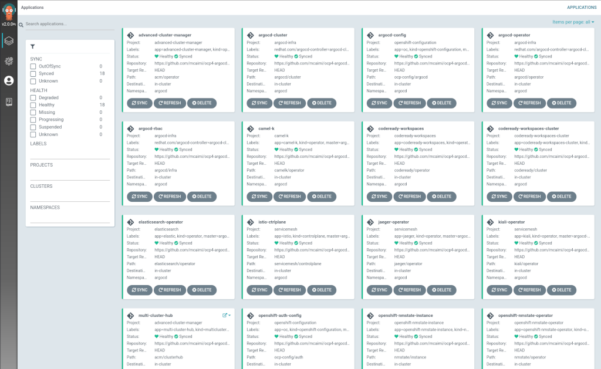

# OCP4 ARGOCD

This repo contains manifests and kustomization template to install, maintain and configure OpenShift 4 features with ArgoCD.

## Pre-Setup Requirements

Installation is managed by Kustomization templates. Openshift 4.3+ is required.

1. Create Namespace

```bash
  $ oc new-project argocd
```

2. Deploy Infrastructure prerequisites (rbac roles, service accounts, security contexts)

```bash
  $ oc apply -k argocd/infra
```

3. Deploy the ArgoCD Operator

```bash
  $ oc apply -k argocd/operator
```

After a while, the operator will be installed and configured accordingly:

```bash
  ^ >> oc get pods -n argocd
  NAME                                                        READY   STATUS    RESTARTS   AGE
  argocd-operator-f89f6b6b5-f6c9g                             1/1     Running   0          16m
  prometheus-operator-56467cbcbf-lh6xs                        1/1     Running   0          16m
```

## ArgoCD Cluster Deployment

After operators are up and running, deploy the Argo Cluster Manifest and Application Manifests

```bash
  $ oc apply -k argocd/cluster
```

This will deploy:

* The Argo CD Cluster with Dex for SSO integration with Openshift
* An "argocd-infra" Application Group
* The "rbac", "operator" and "cluster" applications to let ArgoCD manage itself.

## Deployment of Additional OCP Components with ArgoCD

Additional components can be deployed as ArgoCD Applications by deploying the relevant manifests:

- Local Development Users
- Elasticsearch
- Jaeger Tracing
- Kiali
- Istio Operator
- Istio Control Plane
- Openshift Pipelines Operator (Tekton)
- Openshift Serverless (KNative)
- Kubernetes NMState Operator (Tech Preview)
- RedHat Codeready Workspaces
- RedHat Advanced Cluster Manager
- Camel-K



To install these components, deploy with kustomize:

1. Local development users

  ```bash
  $ oc apply -k apps/config
  ```

This will create an htpasswd-based OAuth provider with two users: a "developer" user with no specific roles granted, and a "localadmin" user with cluster-admin roles.
Passwords are the same as the username. To modify these users, look inside ocp-config/auth/htpasswd-secret.yaml.

2. Elasticsearch Operator

    ```bash
    $ oc apply -k apps/elasticsearch
    ```

3. Jaeger Operator

    ```bash
    $ oc apply -k apps/jaeger
    ```

4. Kiali Operator

    ```bash
    $ oc apply -k apps/kiali
    ```

5. Service Mesh Operator

  Service Mesh Installation is split into two distinct steps: first thing is to deploy the Istio Operator:

    ```bash
    $ oc apply -k apps/servicemesh
    ```

  once that has successfully finished, deploy the Istio Control Plane:

    ```bash
    $ oc apply -k apps/istio-ctlplane
    ```

6. Openshift Pipelines Operator

    ```bash
    $ oc apply -k apps/ocp-pipelines
    ```

7. Openshift Serverless

    ```bash
    $ oc apply -k apps/serverless
    ```

8. Camel-K

  deploy the operator:

    ```bash
    $ oc apply -k apps/camelk
    ```

9. Advanced Cluster Manager

    ```bash
    $ oc apply -k apps/acm
    ```

  after the deployment of the operator has finished, deploy the Cluster Hub

    ```bash
    $ oc apply -k apps/acm-clusterhub
    ```

10. Kubernetes NMState Operator

  deploy the operator:

    ```bash
    $ oc apply -k apps/nmstate
    ```

  then deploy the NMState Instance:

    ```bash
    $ oc apply -k apps/nmstate-instance
    ```

11. RedHat Codeready Workspaces

  deploy the operator:

    ```bash
    $ oc apply -k apps/codeready
    ```

  then deploy the Codeready Cluster

    ```bash
    $ oc apply -k apps/codeready-cluster
    ```

